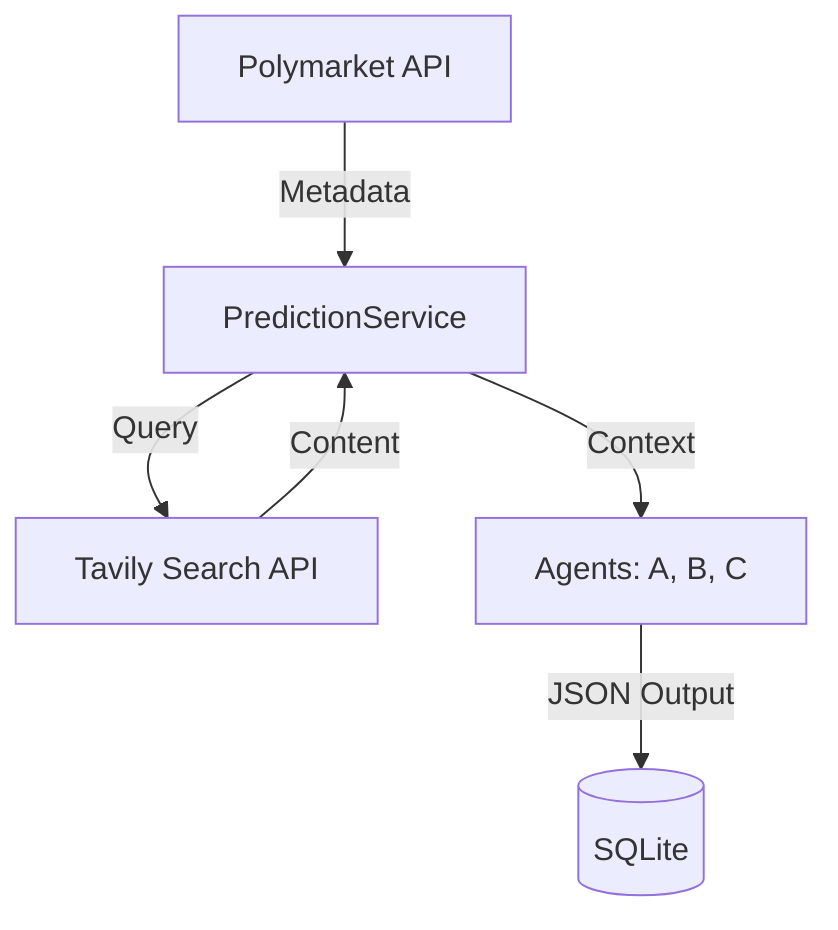
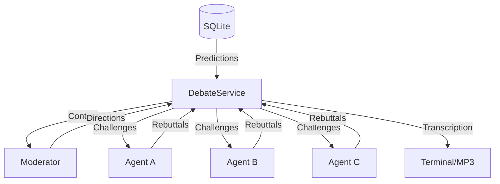

# AI Prediction Battle (Tech Events)

A multi-agent system designed to research and predict outcomes of tech-related Polymarket events. The system uses specialized LLM archetypes—Precision, Signal, and Constraint—to simulate independent research and debate cycles.

---

## 🏗️ Architecture

### V0: Prediction Engine
Predicts binary outcomes using independent web research (Tavily).


### V1: Debate Engine (Turn-based)
Orchestrates a claim-by-claim rebuttal process via a Moderator Agent.


## 🛠️ Agents & Archetypes

| Archetype | Focus | Evidence Preference | Voice (TTS) |
| :--- | :--- | :--- | :--- |
| **Agent A (ChatGPT)** | Precision | Official documentation, primary sources | Shimmer |
| **Agent B (Grok)** | Early Signals | Social sentiment, leaks, experts on X | Onyx |
| **Agent C (Gemini)** | Constraints | Historical precedents, technical feasibility | Fable |
| **Moderator** | Logic | Consistency, factual contradictions | Nova |

---

## 🚦 Quick Start

### 1. Requirements
Ensure you have an `.env` file with the following:
```env
OPENAI_API_KEY=x...
XAI_API_KEY=x...
GEMINI_API_KEY=x...
TAVILY_API_KEY=x...
```

### 2. Setup
```bash
pip install -r requirements.txt
```

### 3. Usage Commands

**Discover Trending Events**
Find IDs or Slugs for active tech markets:
```bash
python main.py discover
```

**Run Full AI Battle (V0 + V1)**
This single command automates the entire flow:
1. Fetches market data.
2. Triggers independent AI research.
3. Generates and stores predictions.
4. Initiates the **Text Debate Layer** between agents.
5. Displays the final debate transcript and reasoning.

```bash
python main.py run [event_id | slug | url]
```

*Example:*
```bash
python main.py run which-company-will-have-the-best-ai-model-for-coding-at-the-end-of-2025
```

---

## 📦 Core Modules

- **`PolymarketService`**: Interfaces with Gamma API to resolve slugs/urls and fetch resolution rules.
- **`PredictionService`**: Orchestrates independent agent research (no cross-agent leakage).
- **`DebateService`**: Implements turn-based logic where agents challenge specific factual claims.
- **`VoiceService`**: Manages OpenAI `tts-1` generation for multi-voice debate output.

## ⚖️ Legal & Positioning
- Global Disclaimer: *“This content is for informational and educational purposes only.”*
- The system generates **probabilistic forecasts**, NOT betting/financial advice.
- No real-money wagering or betting interactions are supported.
